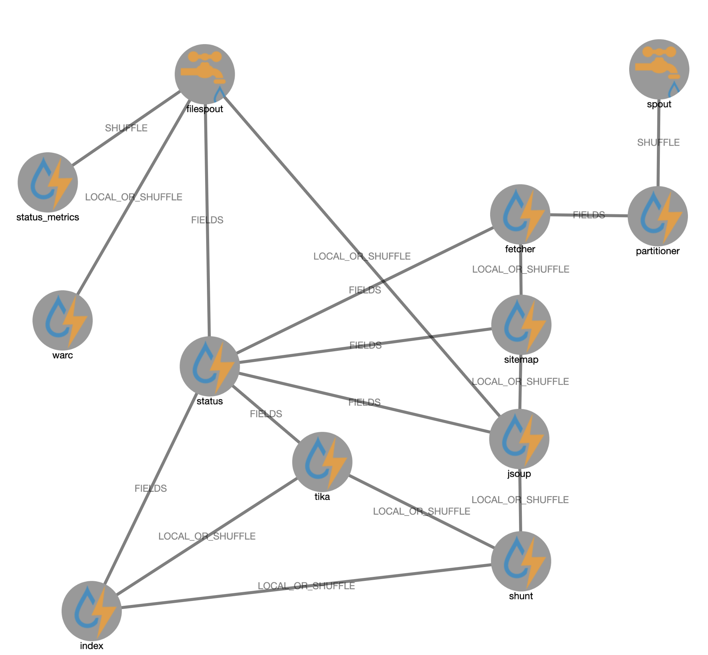

# WARC Elastic Topology

WARC to WARC pipeline with main target CommonCrawls, content and URL frontier are stored in an Elasticsearch index.

:::{figure-md} warc_elastic_pipeline-fig


WARC Elastic **Topology**
:::

## ​Configuring and Tuning S3A Fast Upload

```{note} 
These tuning recommendations are experimental and may change in the future.
```
Because of the nature of the S3 object store, data written to an S3A `OutputStream` is not written incrementally — instead, by default, it is buffered to disk until the stream is closed in its `close()` method. 
This can make output slow because the execution time for `OutputStream.close()`

To enable the fast upload mechanism, set the fs.s3a.fast.upload property (it is disabled by default).

When this is set, the incremental block upload mechanism is used, with the buffering mechanism set in `fs.s3a.fast.upload.buffer`. The number of threads performing uploads in the filesystem is defined by `fs.s3a.threads.max`; the queue of waiting uploads limited by `fs.s3a.max.total.tasks`. The size of each buffer is set by `fs.s3a.multipart.size`.


```{list-table}
:header-rows: 1

* - Parameter
  - Value
  - Description
* - `fs.s3a.fast.upload.buffer`
  -  `array`
  -  The `fs.s3a.fast.upload.buffer` determines the buffering mechanism to use when `fs.s3a.fast.upload` is set to "true", "array" uses arrays in the JVM heap. It will consume memory in a single stream up to the number of blocks set by: `fs.s3a.multipart.size * fs.s3a.fast.upload.active.blocks`
* - `fs.s3a.multipart.size`
  -  500M
  -  Defines the size (in bytes) of the chunks into which the upload or copy operations will be split up. 
* - `fs.s3a.fast.upload.active.block`
  -  8
  -  Defines the maximum number of blocks a single output stream can have active uploading, or queued to the central FileSystem instance's pool of queued operations. 
```


