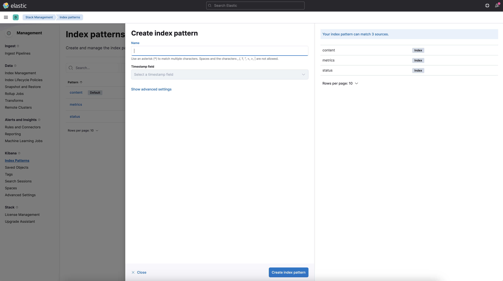
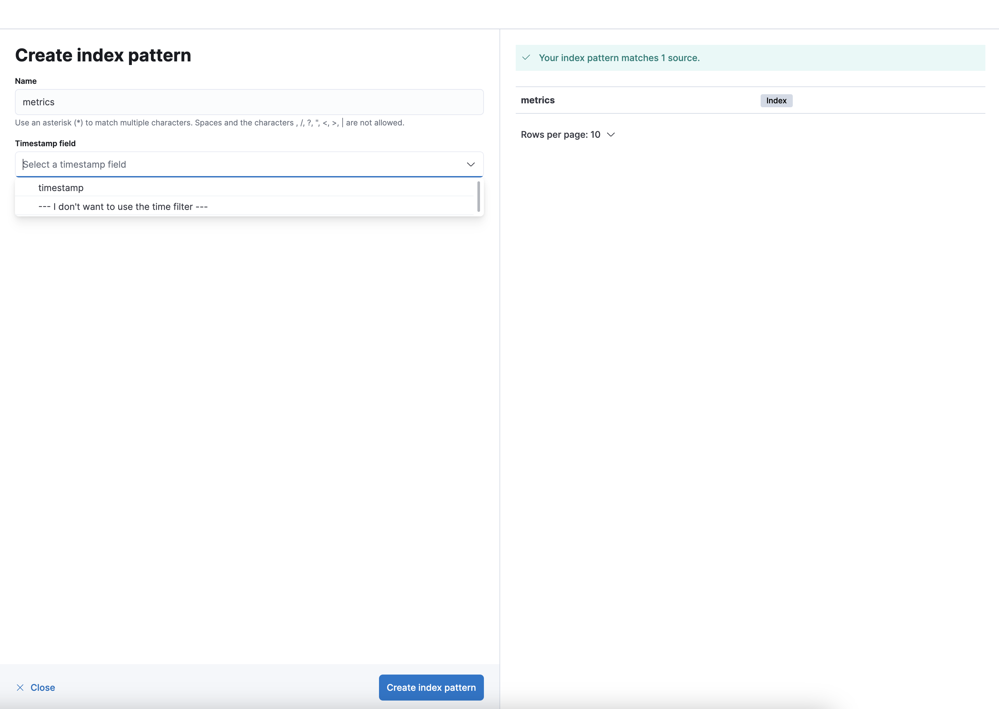
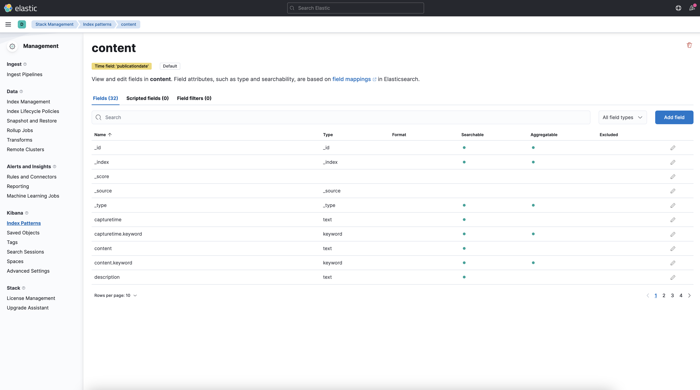

# Tutorial

This tutorial showcases the following use case:

WARC to WARC pipeline with main target CommonCrawls, content and URL frontier are stored in an Elasticsearch index.

**Prerequisite:** You will need to install Java (JDK 11) and `JAVA_HOME` must be defined.

## Using local Environment 

### Install Elastic stack 
- Download [Elasticsearch](https://www.elastic.co/downloads/elasticsearch)
- Download [Kibana](https://www.elastic.co/downloads/kibana)
- Start Elasticsearch server
- Start Kibana server
- Check that Kibana is running by opening (http://localhost:5601)

### Start OWler
1. Clone or download [OWler's](https://opencode.it4i.eu/openwebsearcheu/wp1/owseu-crawler/owler) repository to your local drive.

```{code} bash
# Clone repository
git clone https://opencode.it4i.eu/openwebsearcheu/wp1/owseu-crawler/owler
cd owler
```

2. Open a terminal and navigate to the `owler` folder.

3. Type:

```{code} bash
mkdir crawldata
cp -fr files/storm-crawler/pom.xml storm-crawler
cd storm-crawler

# On Linux/Mac
mvn clean install
cd ..
mvn clean package

# On Windows
.\bin\fscrawler resumes
```

```{note} ARM64 architecture
Edit the `docker-compose.yml` file which is in this folder and add the plateform value to the Apache Storm stack:

---
zookeeper:\
    platform: linux/x86_64\
    image: zookeeper:${ZOOKEEPER_VERSION:-3.8.0}\
    ...\

storm-nimbus:\
    platform: linux/x86_64\
    image: storm:${STORM_VERSION:-2.4.0}\
    ...\

storm-supervisor:\
    platform: linux/x86_64\
    image: storm:${STORM_VERSION:-2.4.0}\
    ...\

storm-ui:\
    platform: linux/x86_64\
    image: storm:${STORM_VERSION:-2.4.0}\
    ...\

storm-crawler:\
    platform: linux/x86_64\
    build: .\
    ...\

```

4. Start OWler:

```{code} bash
storm jar warc-crawler.jar org.apache.storm.flux.Flux topology/warc-elastic-crawler/owler.flux
```

OWler should index all the documents inside your Elasticsearch index and outputs the WARC Files to the object storage directory.

## Create Index pattern

- Open [Kibana](http://localhost:5601/)
- Go to the [Management](http://localhost:5601/app/kibana#/management/) page
- Open the [Index Patterns](http://localhost:5601/app/kibana#/management/kibana/index_patterns?_g=()) page under Kibana settings.
- Click on `Create index pattern`
- Type `status`, `content`, and `metrics` in the input box. Don’t forget to remove the star `*` that is automatically added by default by Kibana.



- Choose the `date` field you’d like to use if you want to be able to filter documents by date.



- Click on `Create index pattern`. You should see something like:



## URL frontier

- Open [Kibana](http://localhost:5601/)
- Go to the [Discover](http://localhost:5601/app/kibana#/discover/) page
- Depending on the date you selected in the `Create index pattern` step, you should see something similar to the following image. 
If you don’t see it, you probably have to adjust the time picker to make sure you are looking at the right period of time.

